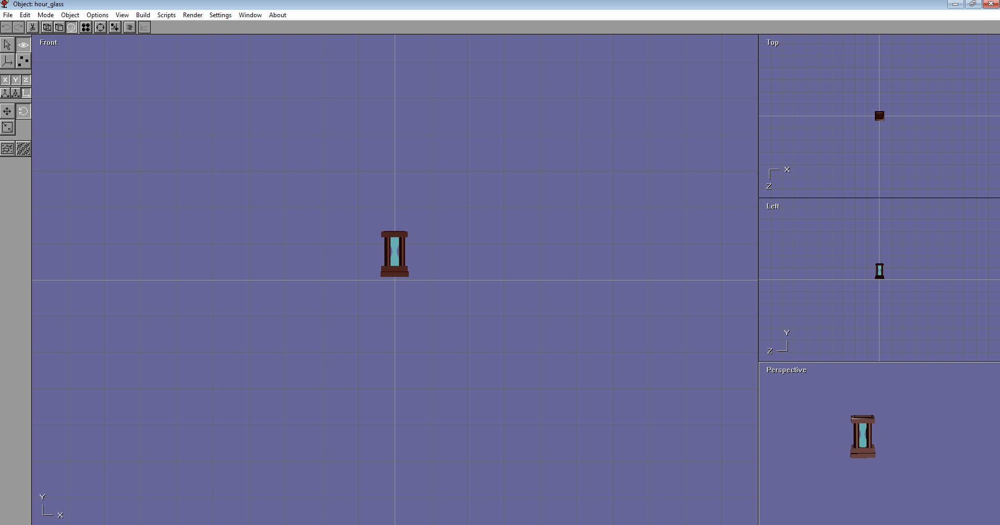
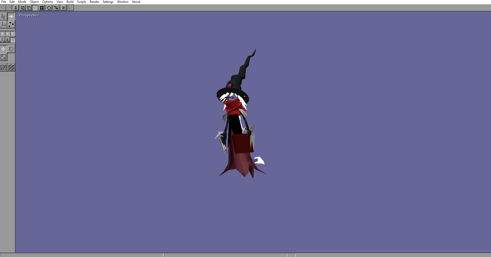

# Anim8or Projects (Low Poly 3D Art)

Some anim8or projects and files; assets for a game built in Monogame, Unity 3d or just for fun

## Updates for July, 23, 2024

Added the following new 3d-models created in anim8or

- A hour glass model created for a monogame sample project.
- A 'Demonologist' 3d model created for a monogame sample project.

